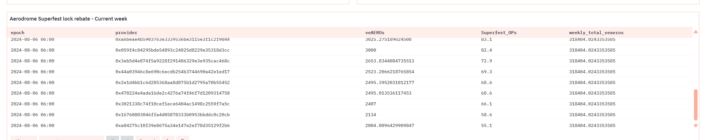

# Aero项目调研报告

### 和uniswap,curve相比的优势
同为ve模型和curve相比，aero的tvl只有curve的1/4，但是盈利是curve的两倍


### 代币的排放模式是否合理
目前看来aero还是处于一个在大放水的阶段的，48个周期刚好一年的时间，排放的aero几乎是线性增长的。从500m到现在的1.2b花了一年多一点的时间，这种通胀最终成为看币价的抛压，币价从高点的2$一路下跌到了现在的0.8$,所以在到达第67周的时候，社区大概率会通过投票来降低后续的排放，拉高自己手上的币价。因为过大通胀对于ve代币持有者和LP持有者来说都不是好事。


### 项目经济模型是否可持续
对于ve33模型来说，最终能否持续还是得看业务能力，base链作为coinbase交易所支持的链，coinbase需要扶持一些好项目，而一些好项目需要上所或者得到一些合规方面的支持，这意味着base链有着光明的未来，作为龙头dex的Aero，其业务能力也很强，过去一年的盈利为$78.18m，和传统老大哥curve的34.94m相比已经有其两倍，所以没有理由去怀疑aero的未来。

### 业务收入和市值所处的位置是否值得入手
由于ve33模型的特殊性，项目初期超高的APR会吸引大量的挖矿进来挖矿，为了获得挖矿的金铲子而拉高币价，所以价格爆拉，然后在代币解锁和APR下降后的双重抛压下暴跌，币价会被砸得很低，很大一部分ve33项目会在高点跑路，但是在aero中，初始分配给项目团队的代币（70m/14%）都是最大锁仓期（4年）

此外除了初始排放以外，后续排放的5%会流向项目团队，按照60m的流动计算的话，流向团队的代币数量大约为3m，和初始锁仓的70m相比微不足道，可以预测，四年内项目团队大概率是不会跑路的。


### 团队和投资机构以及和coinbase的关系
base链作为coinbase交易所扶持的Layer2公链，和Optimism公链强绑定，目前TVL已经排到了第六，上线时间较晚，2023年才完成主网上线，相比与bsc，arb，optimisim等差不多完了一年，但是相比之下base链因为背靠coinbase交易所，基本上好项目都能在coinbase交易所上所，和bsc相比，交易所对项目的扶持力度也更大，所以发展非常迅速，现在tvl已经来到了第6的位置。

据链上分析师的数据显示，coinbase已经回购了接近4.7mAero代币，除去锁定中的ve代币，流通中的aero代币+Lp中的代币数量，这个数量已经接近1/100。支持的力度确实不小。


### 会不会被fork盘项目吸血攻击
aero本身就是fork的op链上的velo项目，只不过有个比较大的区别就是，velo的总供应量是确定的，aero的总供应量是不确定的，属于增发代币，但是aero作为base链上tvl第一的项目，而且作为和base链几乎同期上线的dex项目，其重要地位已经成为了其他用户进入base链的门户，其tvl超过了第二位的uniswap接近3倍。其良好的经济模式可以保证aero长期压着base链上的uniswap，若其他链上出现了类似的仿盘，也很难得到像coinbase交易所这样直接大量回购的支持了。像这样通过增发代币+ve33的模式激励项目起飞的模式，也不是一般的项目方能玩的动的。


## 投资策略

### 定投策略

通过一下一组数据对比，目前买入aero的性价比还是不低的，但是不适合一上来就上仓位。
curve
```
fdv:593.79M
mcap:325.98M
revenue: 34m 
revenue/fdv=34m/593.79M=0.057
```
aero:
```
fdv:950.04m
mcap:449.74m
revenue:78.17m
revenue/fdv=78.17m/950.04m=0.082
```


因为curve币价相对稳定，所以用curve的收益数据和fdv数据，对aero币价进行了一下调整回归。

考虑到三个月后的通胀水平，使用参数0.75对币价进行稀释。

```
（revenue(aero)/revenue(curve)） *  （fdv(curve) /fdv(aero) ） *0.75/ Tokenprice(aero)=78.17m/34m  * 593.79M/950.04m *0.75/0.8=2.3 * 0.625 *0.75 * 0.8=0.8625$
```

> 所以可以得出结论：以目前0.8的价格买入aero是一个风险很低的价位。

参考一下curve的价格曲线，ve模型常见的走势，拉盘->爆砸->价值发现后出现平盘，对于像aero这样通胀的代币，项目初期不适合大仓位的上，不然很容易被套。所以在接下来的三个月里面可以采取定投的策略买入，降低被套的风险，在第64周具体的治理策略出来之后在决定要不要上大仓位。


### WTH池子LP策略

eth 100u

usdc  * u

借贷 or 空单 对冲?

换出100u eth

上升的情况: eth 全部变成u ->现货不亏钱，但是合约会亏钱

合约亏的钱>现货带来的收益（现货在价格上涨的过程中会被线性抛掉）

下降情况： usdc 全部变成eth  -> 总仓位=100u+usdc投入->通过空单对冲掉，

不用借贷因为借贷资金利用率低，需要超额抵押，合约可以开杠杆进行对冲。

这个策略知识在看空eth又想挖矿的时候用，但是eth上涨就有可能会亏钱。

### Ve质押策略

aero可以通过质押aero获得veToken，VeToken，veToken是ERC721标准的NFT,且当通过锁定一定数量的NFT之后，后续如果想要增加锁定的aero，可以注入到已存在的NFT中

锁定aero后，可以对VeNFT做以下管理：

1. Incrase功能可以增加NFT当中锁定的aero数量
2. Extend可以增加aero锁定期
3. Merging 功能可以集中多个VeNFT中锁定的aero代币
4. Transfer功能可以对veNFT进行转移


这一步已经可以获得ve持有者的投票收益（也就是手续费+贿赂的分成）

#### Relay中继

Relay是旨在自动化管理 veNFT投票的过程：

现在只有compound策略进行复投。（获得的收益会被转化为veAero代币）

和一般的ve模型不同，aero的锁定虽然可以长达四年，但中途可以把NFT进行售出（在NFT市场当中），不过现在这个NFT的流动性特别差，可以通过下面的图片看到，上架的NFT锁定了20到2500个Aero代币的NFT上架的只有一个，NFT一个月的交易量可能只有10来单。

[NFT市场信息](https://www.okx.com/zh-hans/web3/marketplace/nft/collection/base/venft-322483)


 #### FlighSchool

**veAERO Locking**

> Methodology:
>
> Flight school qualification happens at the NFT level, not the user level.
>
> The dune query looks at each and every veNFT and totals the number of liquid locks AND relay compounds that occured for that NFT during the flight. The total of relay compounds and locks needs to exceed 2500 for the NFT to count for flight school.
>
> For NFT's that qualify from any user or protocol, a 1.25x boost is applied to relay compounds (the amount of veAERO compounded by the NFT during the flight period).
>
> For protocols only, their first 5 times recieving a distribution for locking will recieve a 1.25x boost to their entire combined balance of new locks and relay compounds. This number can be tracked in the "flights completed" column.

> 方法：
>
> FlightSchool资格认证发生在NFT级别，而不是用户级别。
>
> 沙丘查询查看每个veNFT，并总计该Flight期间该NFT的锁定和Relay策略复投的数量。这个数量超过2500个的NFT才能计入FlightSchool。
>
> 对于符合任何用户或协议条件的NFT，将对relay策略的复投（Flight期间复投的veAERO量）施加1.25倍的增加。
>
> 仅对于新协议来说，他们的前5次收到锁定分发将使新锁和Relay复投的整体收益增加1.25倍。该数字可以在“已完成的航班”列中跟踪。

一个Flight会维持一个月，结束之后1-2周获得新的veNFT

FlightSchool认定规则

1. 添加一个新的veNFT，并锁定2500Veaero进去
2. 为已存在的veNFT添加2500Veaero
3. FlightSchool期间产生的复利超过2500Aero，这大约需要120000的Aero才行


所以说其实这个1.25x的收益加成其实是很难拿到的，因为每2500Aero（可能接近2000u）的一个仓位只能吃到一个月的加成。这个激励可能更多的是针对大户（仓位在120000Aero，大概10w美金），因为通过第三点可以在每个FlightSchool期间都吃到1.25x的加速。

此外对于新的协议放也可以获得1.25x的veaero收益加成

> For protocols only, their first 5 times recieving a distribution for locking will recieve a 1.25x boost to their entire combined balance of new locks and relay compounds. This number can be tracked in the "flights completed" column.
>
> ——from dune

> 仅对于协议来说，他们的前5次收到锁定分发将使新的锁和Relay复投化的整体数量增加1.25倍。该数字可以在“已完成的航班”列中跟踪。    
>
> ——从dune中获取的数据

所以可以得出结论：

FlightSchool是一个针对协议方和大户的激励计划，和小散户基本没什么关系。

#### Optimism Super Fest Rewards Program

>  Find information on the Optimism Super Fest Rewards Program distribution here. OP will be distributed on a weekly cadence through the Super Fest site.
>
> Lock more than 620 veAERO during the week to a single NFT to be eligible. These can be new locks or increases to locks, but NOT time extensions.
>
> Rewards will be able to be claimed weekly here: https://jumper.exchange/superfest/rewards-from-aerodrome-on-base/

> 在此处查找有关乐观超级节日奖励计划分发的信息。OP将以每周节奏通过Super Fest网站分发。
>
> 将一周内超过620个veAERO锁定到单个NFT才有资格。这些可以是新锁或增加锁，但不能是时间延长。

和FlightSchool类似，这个激励计划的奖励也是一次性的，新锁620Aero，或者增加620Aero才能被认定资格，通过Dune的历史数据可以算一下收益率。



```
以倒数第二行的数据为样本
Op价格：1.2$
获得op的数量:58.6
aero的价格: 0.67$
aero的数量: 2134
收益率=(1.2*58.6)/(0.67*2134)*100%=4.9%
```

所以这个收益率其实不算低，一周就获得4.9%的一个Op代币激励。

#### 质押策略

所以FlightSchool是要求在1个月里面存够2500aero，而Op激励是一周要求620Aero，如果每周都纯如652，那么一个月下来刚好是2500，这样就能把两个激励计划的加成都吃满。
