# 决定期权价格的几个因数

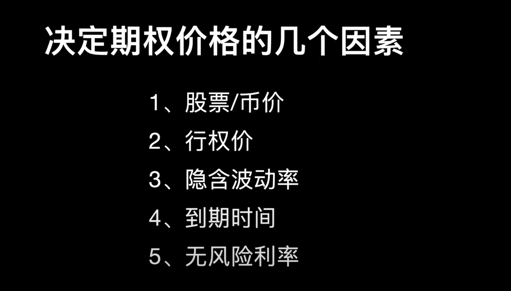

可以不赌方向，通过波动率进行赚钱。

## 波动率

### 隐含波动率

平值期权买的人多了，隐含波动率就会上升，从侧面反应市场情绪？

重大的消息发布前隐含波动率会上升，远期波动率变化受消息影响较小。

#### 波动率微笑

往上翘的一方买家购买欲望强烈，说明大家看的方向，看空还是看多。

可以卖出价外期权，买入价内的，等待IV回归之后平仓。

[Data Lab | Greeks.live](https://www.greeks.live/#/deribit/tools/datalab/ETH)

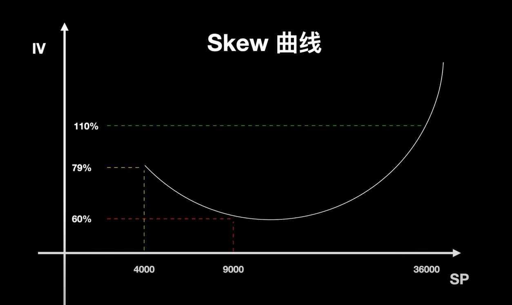

### 历史波动率

历史一段时间的波动率

### 实现波动率

# 希腊字母

## Delta

Delta用来衡量股票/币价波动对期权价格的影响

作为头寸方向的判断

现货的Delta为1

期货的Delta可以通过杠杆超过1

0.5表示平值期权

等于0表示Delta中性

小于0代表空头

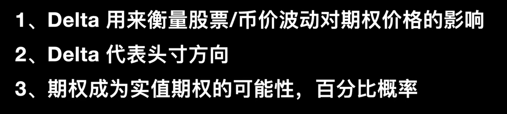

### 跨式期权策略

通过Delta中性来构建跨式期权,可以用来对冲掉方向的影响。 

1.买入实值期权和虚值期权构建跨式期权=做多波动

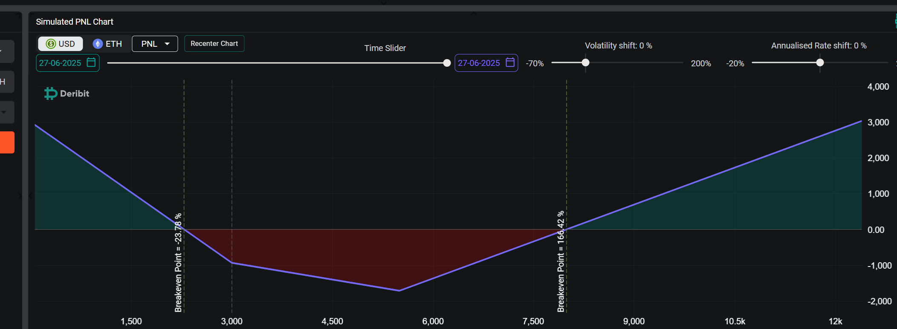

2.卖出实值期权和虚值期权构建跨式期权=做空波动

3.Delta中性策略需要不停的调整仓位动态的控制Delta中性

## Gamma

Gamma是Delta增加的加速度

期权买方，Gamma均为正

期权卖方,Gamma均为负

从图可以看出平值期权的Gamma是最大的，越是远的期权gamma会越小一些

平值期权Ganna最大意味着上涨下跌的时候损益变化是比较大的。

买入虚值期权，期权又虚值期权变为市值期权的时候Gamma波动会带来巨额收益。

## Vega

Vega是用来衡量标的资产价格波动率变化时，期权价格的变化幅度。

买入期权vega都是正的。

相同行权价行权日的期权vega是相等的

IV+1%=>期权价格增加一个vega

远期的vega更大=>越远的期权相信空间越大

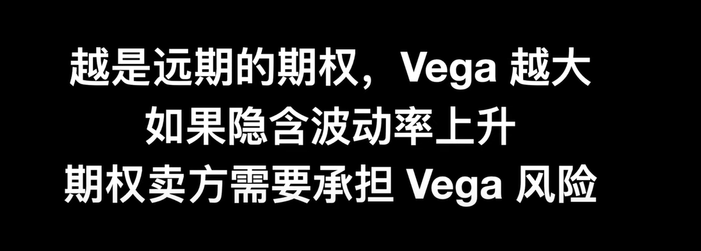

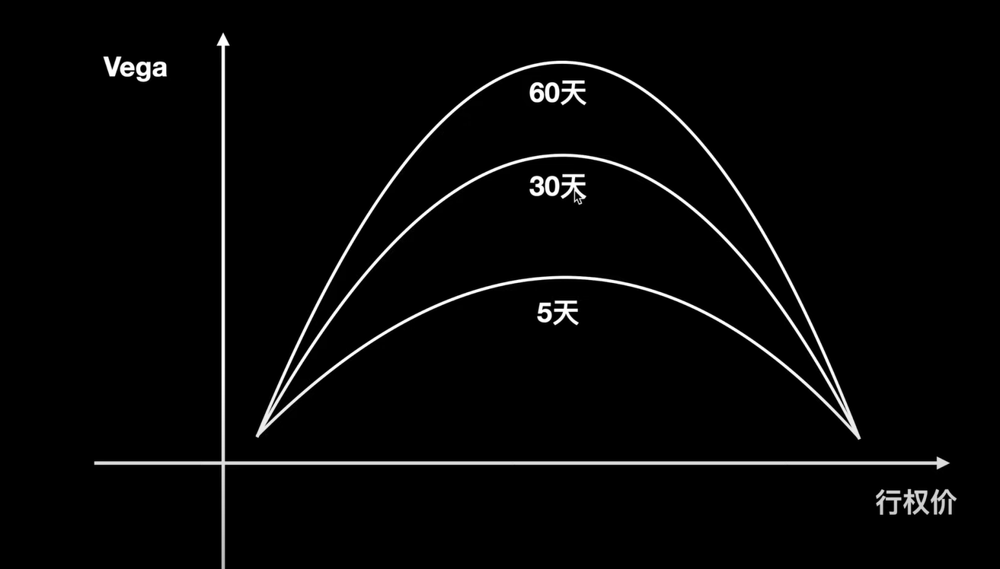

## Theta

Theta是用来衡量期权价值随着时间流逝，衰减的速率。

末日期权Theta会很大快速失去价值。

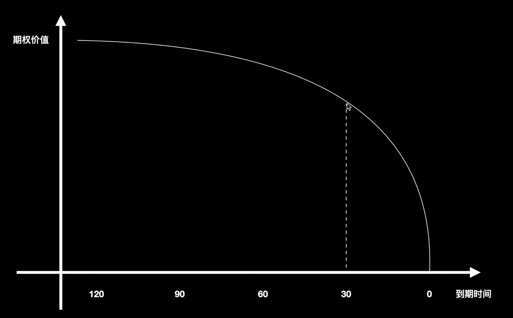

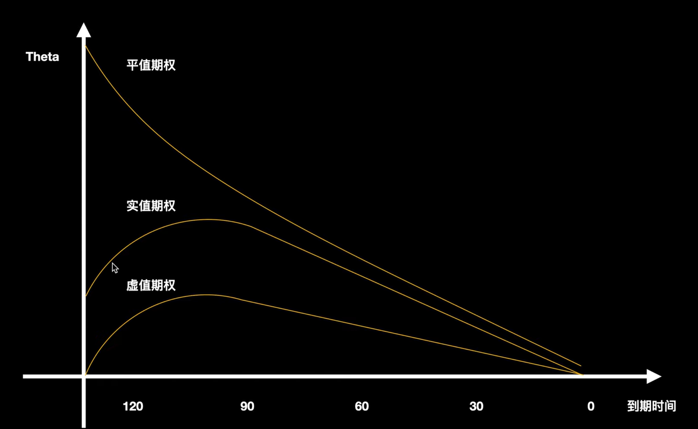

根据以下这段话的描述可以得知，在波动率高的时候卖出期权，Theta也就越大，睡着时间的变化期权就会丢失掉大量的价值，赚取时间价值，所以尽可能的要在波动率高的时候卖出期权。

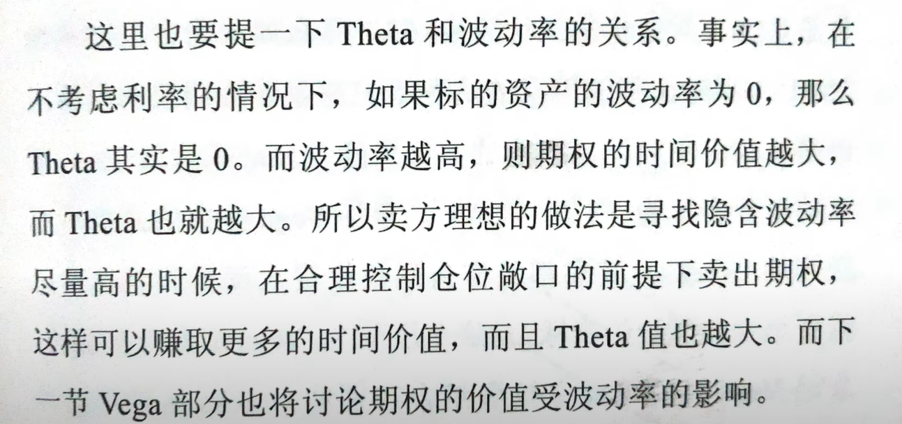

# 比例价差策略

比例价差策略很适合来做价格突破用，在币价小涨的情况下可能会亏掉有限的钱，币价下跌可能赚到一点钱，如果币价大涨可以赚到上线空间无线的钱，是一种花小钱波大钱的策略。

和跨式期权相比这个曲线式需要看币价方向的，牺牲掉某一个方向的收益到另外一个方向去。

和合约和现货等相比，损失式有限的，看错方向也肯能赚点小钱。

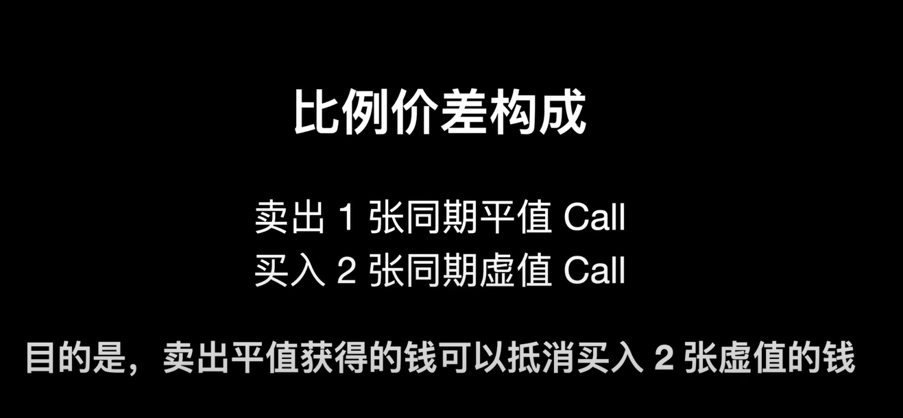

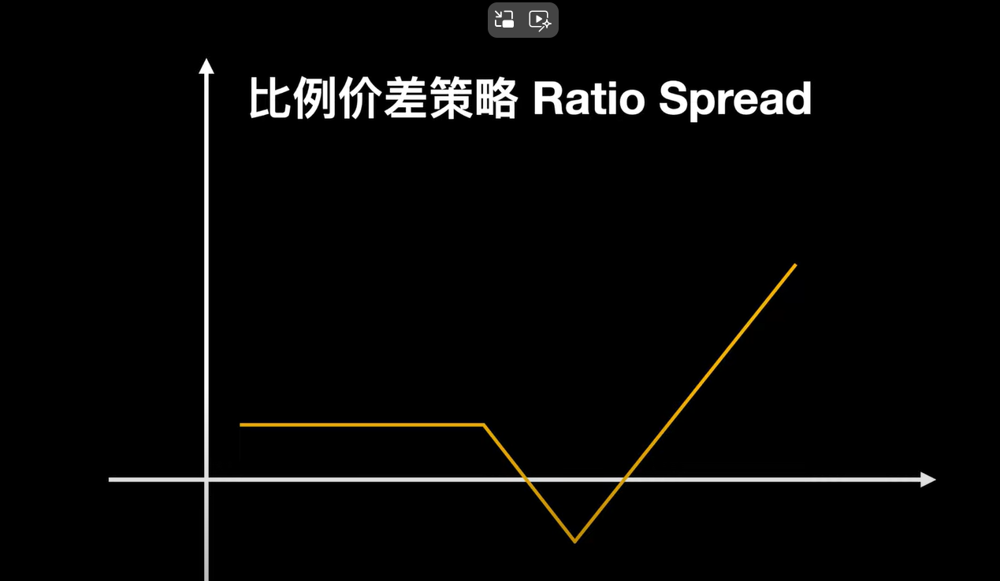

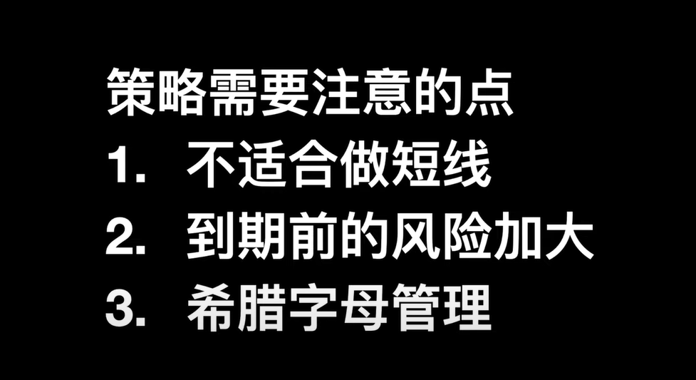

也可以用put来构建反向的曲线

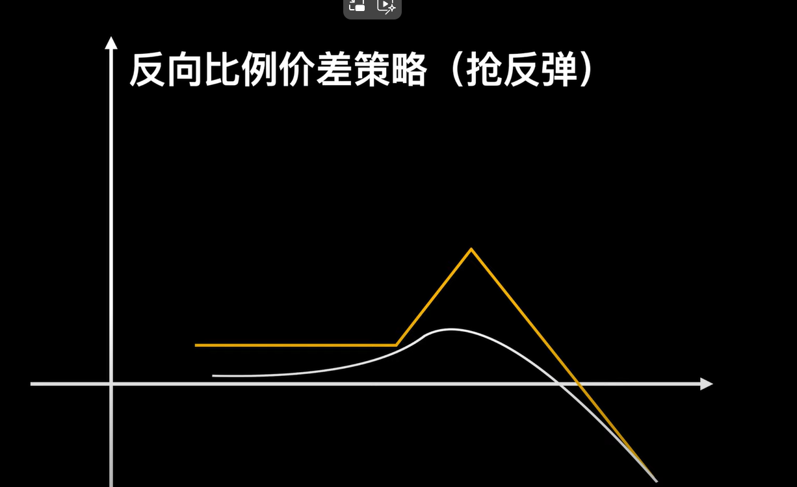

# 领口策略

可以在市场暴跌的时候保护我们的仓位。

在持有现货的同时，买入put期权保护自己的仓位，同时卖出call赚取权利金抵消买入put的费用，锁定损失的同时限制了收益的上线。

最经典的案例式2000年库班用这个策略躲过了互联网泡沫对其雅虎股票的影响。

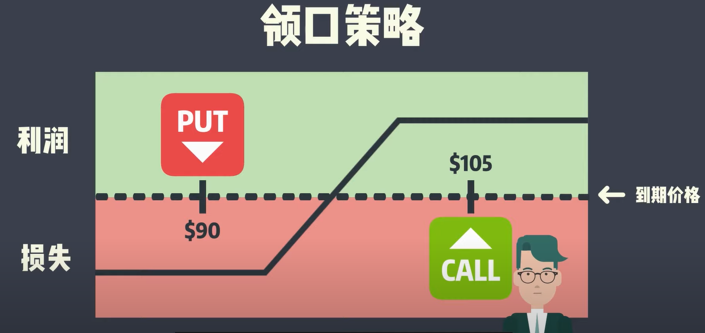

# 牛市价差策略

牛市价差策略曲线和领子策略曲线比较像，收益和下跌都是有限的，但是他们的出发点和期权买入卖出点位是不同的，领子策略主要是想在不抛出现货的前提下锁定最大收益和最大损失，而牛市价差策略则是想尽可能获得在某个价位区间更大的收益，比如看涨某个币能涨200个点，但是不看好它能涨300个点，则可以在300个点的位置卖出同期的put赚取权利金，若币价真的涨超过300点，则往后的买入call能带来的收益和put的赔付抵消掉了，收益曲线变为直线。

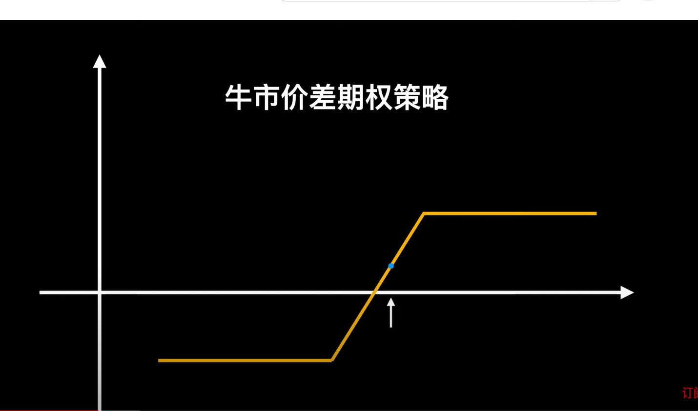

 

